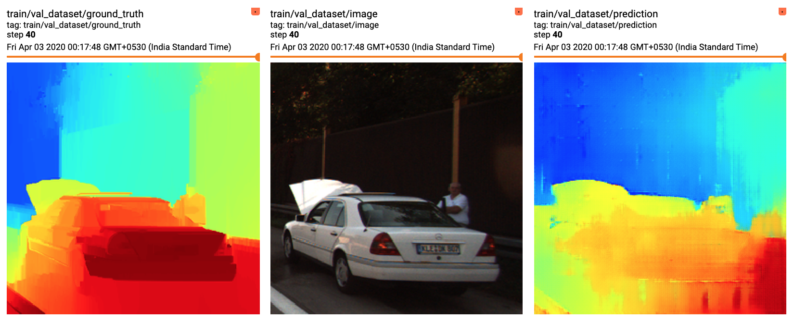
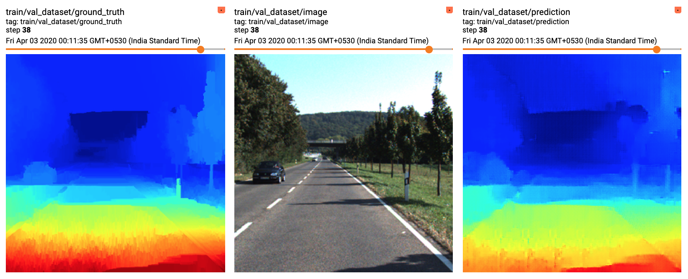
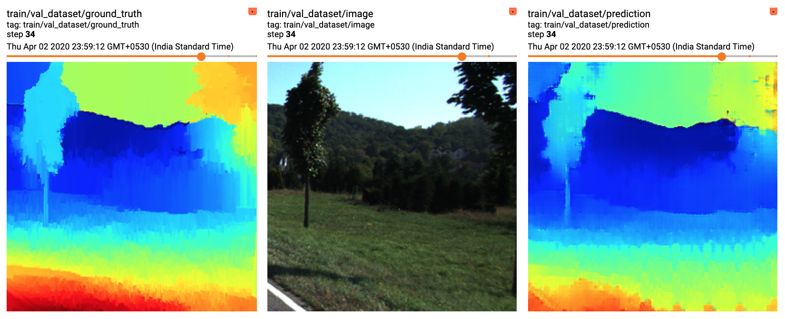
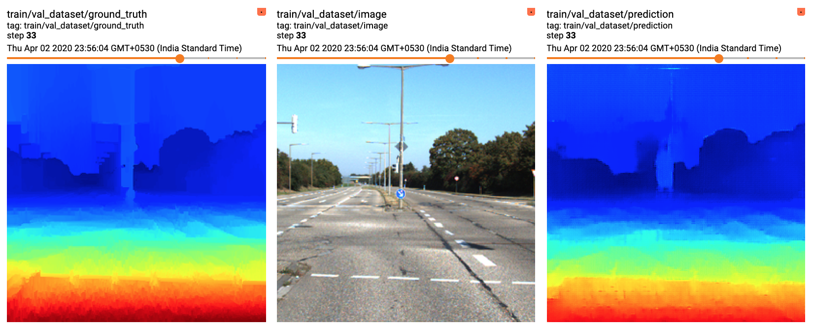
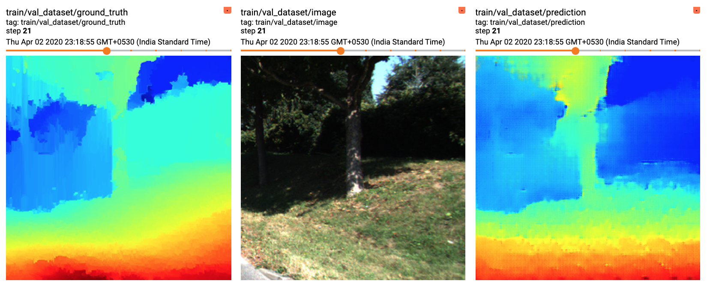

# Image Depth Prediction using GANs

Tensorflow 2.2.0 implementation of single image stereo depthmap prediction using GANs.

## Details

Schematics for the Architectures are available [here](./models.md).

*Dataset Link:* [https://www.kaggle.com/greg115/pix2pix-depth](https://www.kaggle.com/greg115/pix2pix-depth)

The images have been taken from the KITTI Vision Benchmark Suite and the depthmaps were generated using the SGBM Algorithm.

## Results

